# Line Drawings: `line_drawings`

| Class \ Index | 001 | 002 | 003 | 004 | 005 | 006 | 007 | 008 | 009 | 010 |
| ------------- | --- | --- | --- | --- | --- | --- | --- | --- | --- | --- |
| airplane |  | 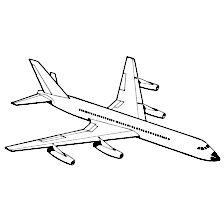 | 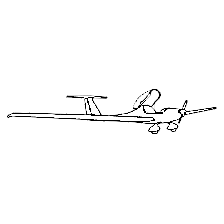 | 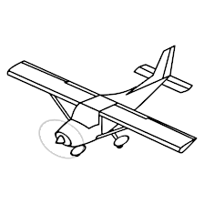 | 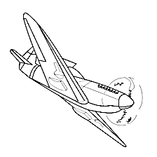 | 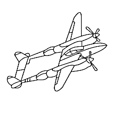 | 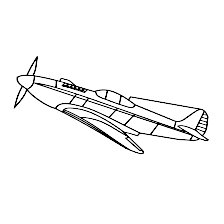 | 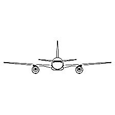 |  | 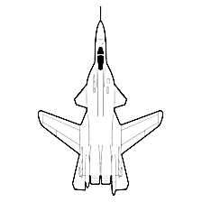 |
| automobile |  | 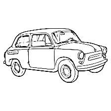 | 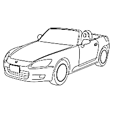 | 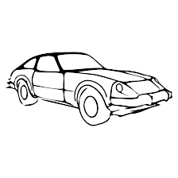 | 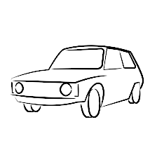 | 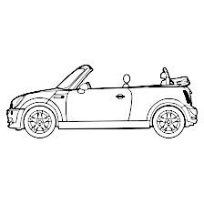 | 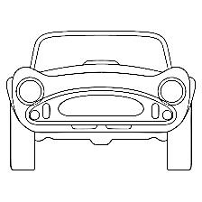 | 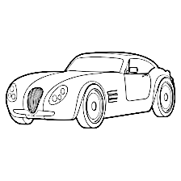 | 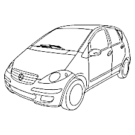 | 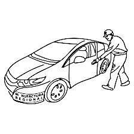 |
| bird |  | 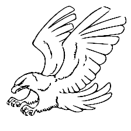 | 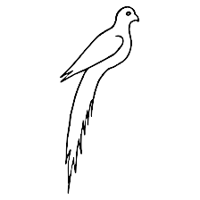 | 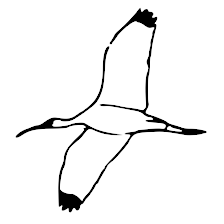 | 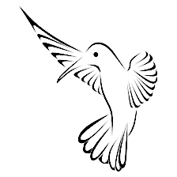 | 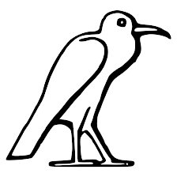 | 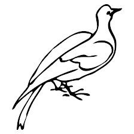 | 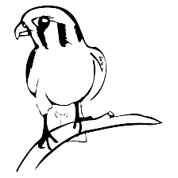 | 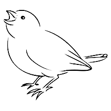 |  |
| cat |  | 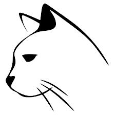 | 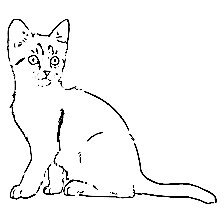 | 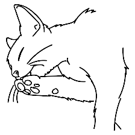 | 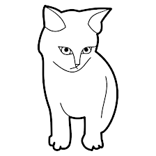 | 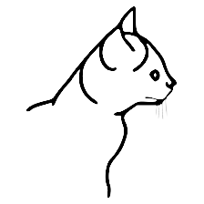 | 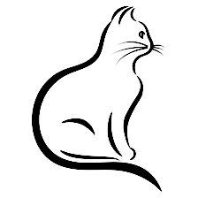 | 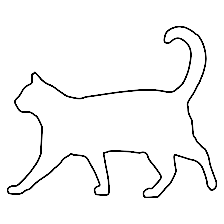 | 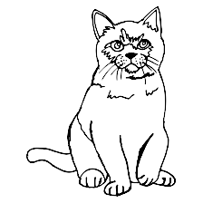 | 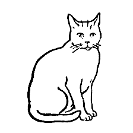 |
| deer |  | 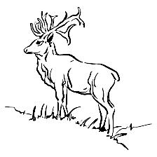 | 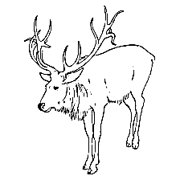 | 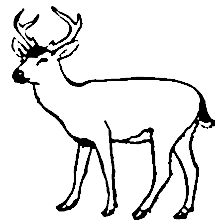 | 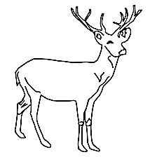 | 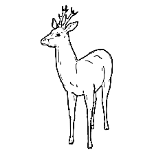 | 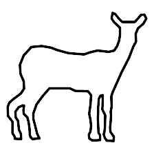 | 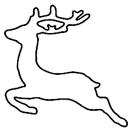 | 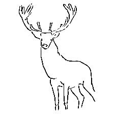 | 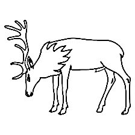 |
| dog |  | 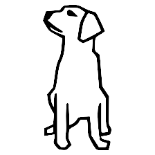 | 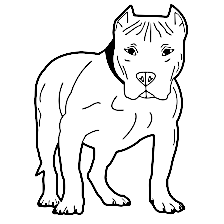 | 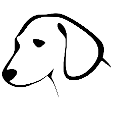 | 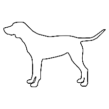 | 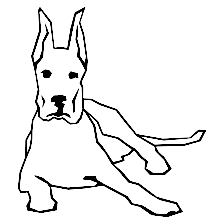 |  | 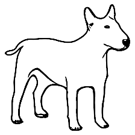 | 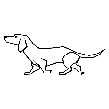 |  |
| frog |  |  |  |  |  |  |  |  |  |  |
| horse |  |  |  |  |  |  |  |  |  |  |
| ship |  |  |  |  |  |  |  |  |  |  |
| truck |  |  |  |  |  |  |  |  |  |  |