CIFAR-10G
=========

Stylised out-of-domain generalisation test images for models trained with the [`CIFAR-10` dataset](https://www.cs.toronto.edu/~kriz/cifar.html). 

CIFAR-10G © 2021 by Benjamin D. Evans is licensed under CC BY-NC-SA 4.0. To view a copy of this license, visit http://creativecommons.org/licenses/by-nc-sa/4.0/

Instructions
------------

Clone the repository into your workspace with the following command:

```
git clone https://github.com/bdevans/CIFAR-10G.git
```

Within the `224x224` subdirectory, there is a directory for each type of test set:

```
['line_drawings', 'line_drawings_inverted',
 'contours', 'contours_inverted',
 'silhouettes', 'silhouettes_inverted']
```

Within each of these directories are ten subdirectories named after the `CIFAR-10` categories:

```
('airplane', 'automobile', 'bird', 'cat', 'deer', 'dog', 'frog', 'horse', 'ship', 'truck')
```

Each of these category directories contains ten examples of each type of image. This allows the images to be loaded (and processed) on the fly with e.g. a `Keras` `ImageDataGenerator` using the [`flow_from_directory` method](https://www.tensorflow.org/api_docs/python/tf/keras/preprocessing/image/ImageDataGenerator#flow_from_directory). 

The directory structure with the `224x224` folder is illustrated below. 

```
.
├── contours
│   ├── airplane
│   │   ├── airplane001.png
│   │   ├── airplane002.png
│   │   ├── airplane003.png
│   │   └── ...
│   ├── automobile
│   │   ├── automobile001.png
│   │   ├── automobile002.png
│   │   ├── automobile003.png
│   │   └── ...
│   ├── bird
│   │   └── ...
│   └── ...
├── contours_inverted
│   ├── airplane
│   ├── automobile
│   ├── bird
│   └── ...
├── line_drawings
│   └── ...
├── line_drawings_inverted
│   └── ...
├── silhouettes
│   └── ...
└── silhouettes_inverted
    └── ...
```

Example Images
--------------

| Image | Line Drawings | Line Drawings (inverted) | Silhouettes | Silhouettes (inverted) | Contours | Contours (inverted) |
| ----- | ------------- | ------------------------ | ----------- | ---------------------- | -------- | ------------------- |
| airplane001 | 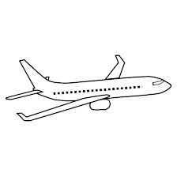 | 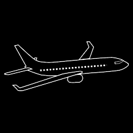 | 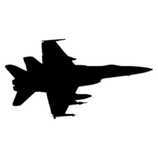 | 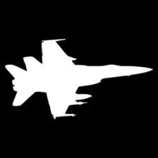 | 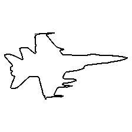 | 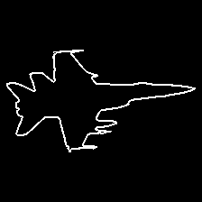 |
| automobile001 | 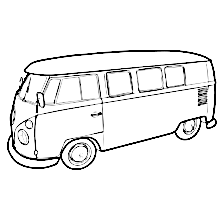 | 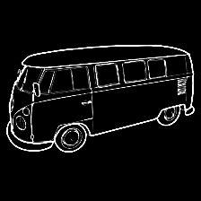 |  |  | 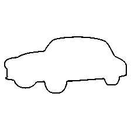 | 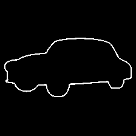 |
| bird001 | 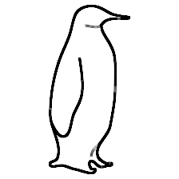 | 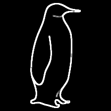 | 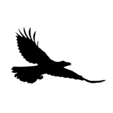 | 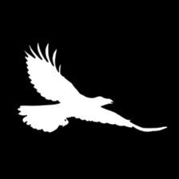 | 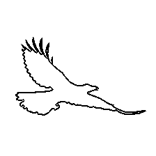 | 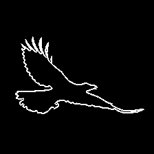 |
| cat001 | 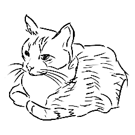 | 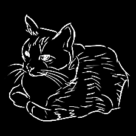 | 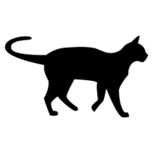 | 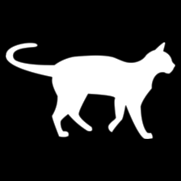 | 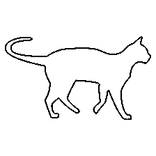 |  |
| deer001 | 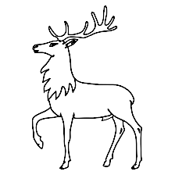 | 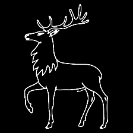 | 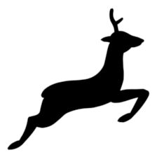 | 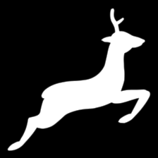 | 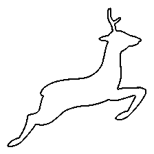 | 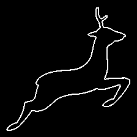 |
| dog001 | 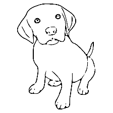 | 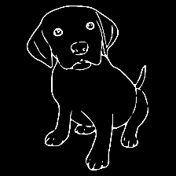 | 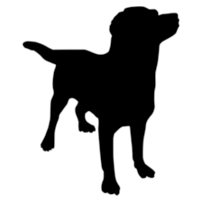 | 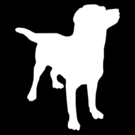 | 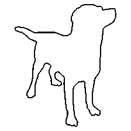 | 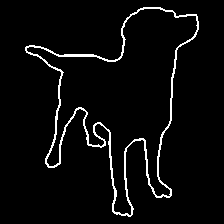 |
| frog001 | 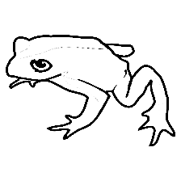 | 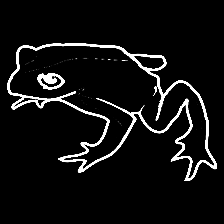 | 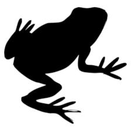 |  | 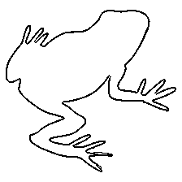 | 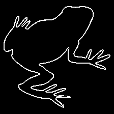 |
| horse001 | 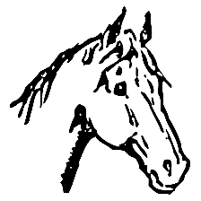 | 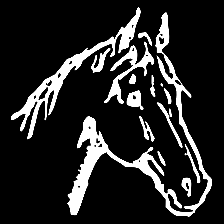 | 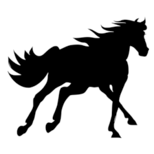 | 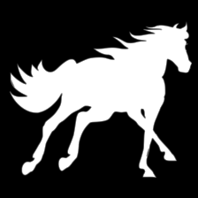 | 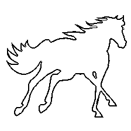 | 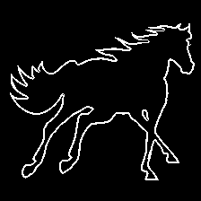 |
| ship001 | 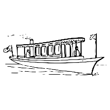 | 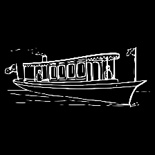 | 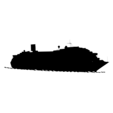 | 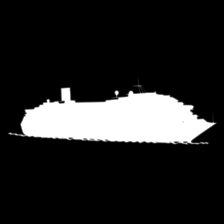 | 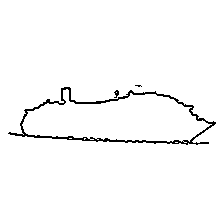 | 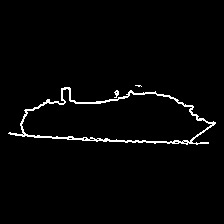 |
| truck001 |  |  |  |  |  |  |
