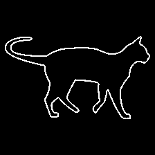
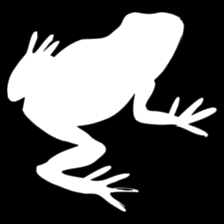

CIFAR-10G
=========

Stylised out-of-domain generalisation test images for models trained with the [`CIFAR-10` dataset](https://www.cs.toronto.edu/~kriz/cifar.html). 

[](https://zenodo.org/badge/latestdoi/335421527)
[](https://creativecommons.org/licenses/by-nc-sa/4.0/)

CIFAR-10G © 2021 by Benjamin D. Evans is licensed under Attribution-NonCommercial-ShareAlike 4.0 International. To view a copy of this license, visit http://creativecommons.org/licenses/by-nc-sa/4.0/

Instructions
------------

Clone the repository into your workspace with the following command:

```
git clone https://github.com/bdevans/CIFAR-10G.git
```

Within the `224x224` subdirectory, there is a directory for each type of test set:

```
['line_drawings', 'line_drawings_inverted',
 'contours', 'contours_inverted',
 'silhouettes', 'silhouettes_inverted']
```

Within each of these directories are ten subdirectories named after the `CIFAR-10` categories:

```
('airplane', 'automobile', 'bird', 'cat', 'deer', 'dog', 'frog', 'horse', 'ship', 'truck')
```

Each of these category directories contains ten examples of each type of image. This allows the images to be loaded (and processed) on the fly with e.g. a `Keras` `ImageDataGenerator` using the [`flow_from_directory` method](https://www.tensorflow.org/api_docs/python/tf/keras/preprocessing/image/ImageDataGenerator#flow_from_directory). 

The directory structure with the `224x224` folder is illustrated below. 

```
.
├── contours
│   ├── airplane
│   │   ├── airplane001.png
│   │   ├── airplane002.png
│   │   ├── airplane003.png
│   │   └── ...
│   ├── automobile
│   │   ├── automobile001.png
│   │   ├── automobile002.png
│   │   ├── automobile003.png
│   │   └── ...
│   ├── bird
│   │   └── ...
│   └── ...
├── contours_inverted
│   ├── airplane
│   ├── automobile
│   ├── bird
│   └── ...
├── line_drawings
│   └── ...
├── line_drawings_inverted
│   └── ...
├── silhouettes
│   └── ...
└── silhouettes_inverted
    └── ...
```

Example Images
--------------

| Image | Line Drawings | Line Drawings (inverted) | Silhouettes | Silhouettes (inverted) | Contours | Contours (inverted) |
| ----- | ------------- | ------------------------ | ----------- | ---------------------- | -------- | ------------------- |
| airplane001 |  |  |  |  |  |  |
| automobile001 |  |  |  |  |  |  |
| bird001 |  |  |  |  |  |  |
| cat001 |  |  |  |  |  |  |
| deer001 |  |  |  |  |  |  |
| dog001 |  |  |  |  |  |  |
| frog001 |  |  |  |  |  |  |
| horse001 |  |  |  |  |  |  |
| ship001 |  |  |  |  |  |  |
| truck001 |  |  |  |  |  |  |

Citation
--------

If you use this dataset in your own research, we would appreciate you citing the journal article for which it was created (in addition to the Zenodo archive reference). The accompanying repository for the model code is here: https://github.com/bdevans/BioNet. 

```
@article{EvansBiologicalConvolutions,
title = {Biological convolutions improve DNN robustness to noise and generalisation},
journal = {Neural Networks},
volume = {148},
pages = {96-110},
year = {2022},
issn = {0893-6080},
doi = {https://doi.org/10.1016/j.neunet.2021.12.005},
url = {https://www.sciencedirect.com/science/article/pii/S0893608021004780},
author = {Benjamin D. Evans and Gaurav Malhotra and Jeffrey S. Bowers},
keywords = {Deep learning, Convolutional neural network, Biological constraint, Gabor filter, Noise tolerance, Generalisation},
abstract = {Deep Convolutional Neural Networks (DNNs) have achieved superhuman accuracy on standard image classification benchmarks. Their success has reignited significant interest in their use as models of the primate visual system, bolstered by claims of their architectural and representational similarities. However, closer scrutiny of these models suggests that they rely on various forms of shortcut learning to achieve their impressive performance, such as using texture rather than shape information. Such superficial solutions to image recognition have been shown to make DNNs brittle in the face of more challenging tests such as noise-perturbed or out-of-distribution images, casting doubt on their similarity to their biological counterparts. In the present work, we demonstrate that adding fixed biological filter banks, in particular banks of Gabor filters, helps to constrain the networks to avoid reliance on shortcuts, making them develop more structured internal representations and more tolerance to noise. Importantly, they also gained around 20--35% improved accuracy when generalising to our novel out-of-distribution test image sets over standard end-to-end trained architectures. We take these findings to suggest that these properties of the primate visual system should be incorporated into DNNs to make them more able to cope with real-world vision and better capture some of the more impressive aspects of human visual perception such as generalisation.}
}
```
